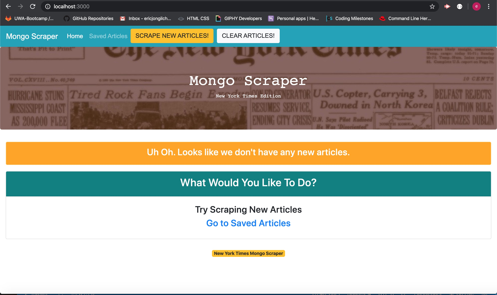
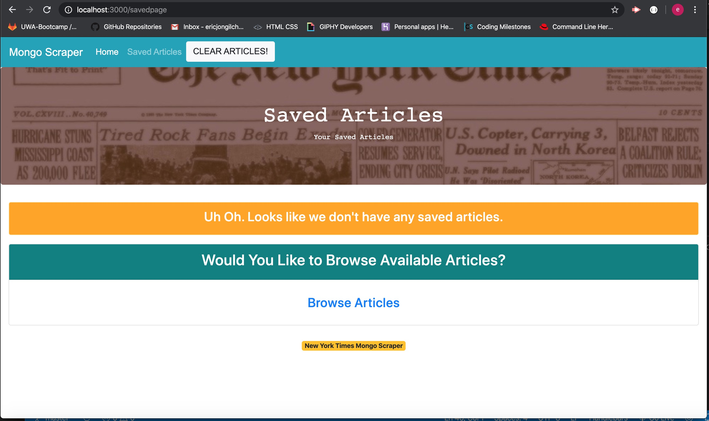

# Mongo Scraper New York Times edition

### `Mongo_Scraper` is an app that a user can scrape the current New York Times articles and make notes on the saved articles. 

## App running screenshots

Figure 1. Initial loading of homepage

Figure 2. Initial loading of saved page

Figure 3. `Scrape New Articles!` button clicked and scraped articles rendered on homepage.

Figure 4. `Save Article` button clicked on homepage and the saved srticles rendered on saved page.

Figure 5. `Article Notes` button clicked on saved page alerts with article's _id. More note features under construction

## Current Development
- GitHub Repo created
- File directories structure
- Front end design with Bootstrap
- `Scrape New Articles!` button click handling and rendering scraped articles on main page
- `CLEAR ARTICLES!` button click handling and delete all articles from the database
- `Save Article` button click handling and rendering saved articles on saved page
- `Delete From Saved` button click handling and removal from database
- `Article Notes` button click event identifies the article's _id
- Heroku deployed with currently developed features

## Under Construction
- More Notes features - modal pop-up, save new note, delete note, rendering all existing notes

Programming tool used
- HTML, CSS, Bootstrap, express-handlebars, Javascript, jQuary, Axios, npm packages, NodeJs, Mongoose and MongoDB

## [Run app on Heroku](https://pure-sierra-54185.herokuapp.com/)