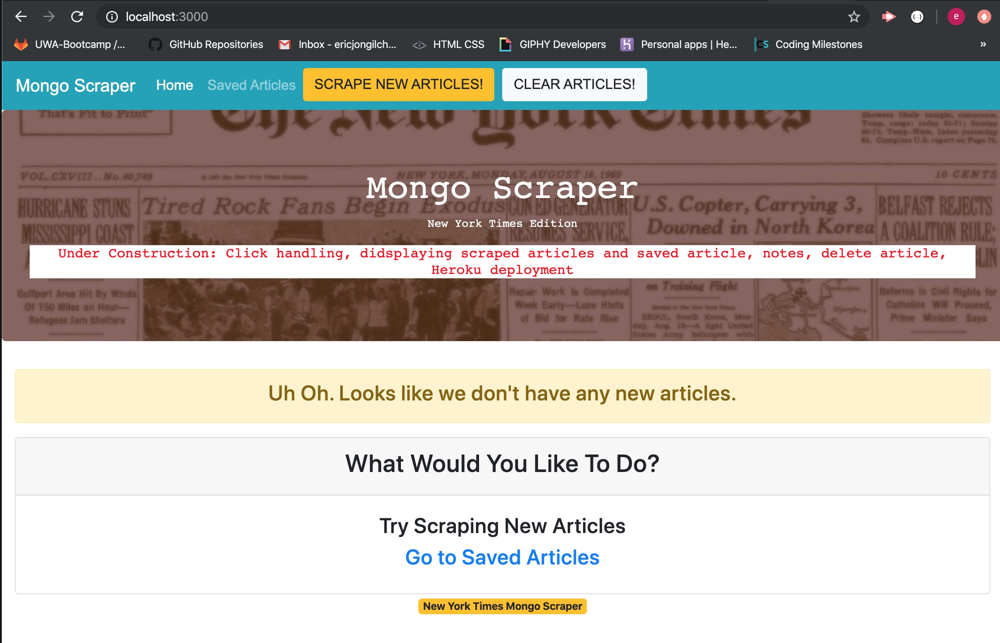
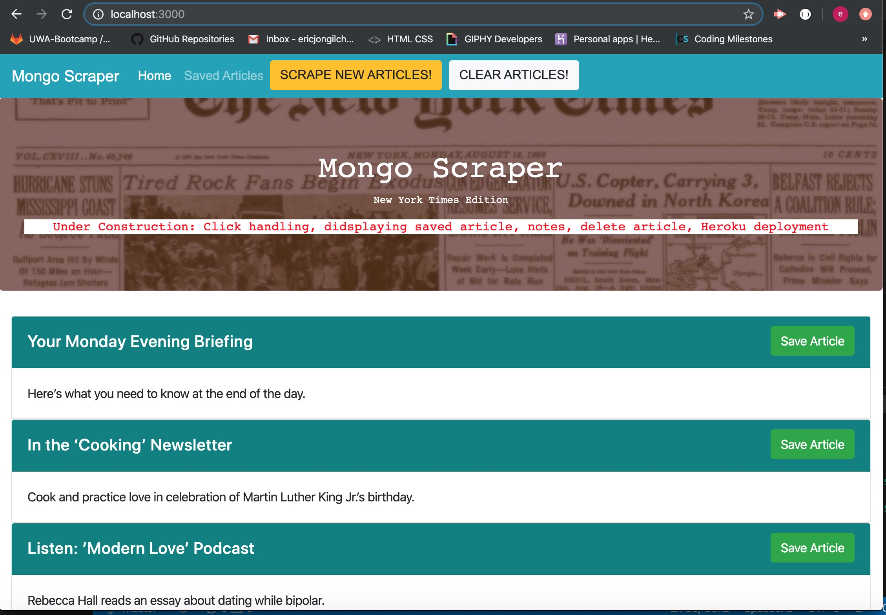

# Mongo Scraper New York Times edition

### `Mongo_Scraper` is an app that a user can scrape the current New York Times articles and make notes on the saved articles. 

### App running screenshots

Figure 1. Initial loading of the app.

Figure 2. `Scrape New Articles!` button clicked and displays scraped articles on main page.

Current Development
- GitHub Repo created
- File directories structure
- Basic front end design with Bootstrap
- Scraping nytimes.com articles manually using `localhost:3000/scrape` and store `id`, `headline`, `url` and `summary` data into `mongoHeadlines` database in MongoDB.
- Scrape new article button click handling and displaying scraped article on main page.
- Clear articles button click handling and delete all articles in the database

Under Construction: 
- Click handling - save article, delete article from saved page
- displaying saved article
- notes function
- Heroku deployment link will be posted upon deployment

Programming tool used
- HTML, CSS, Bootstrap, express-handlebars, Javascript, jQuary, Axios, npm packages, NodeJs, Mongoose and MongoDB