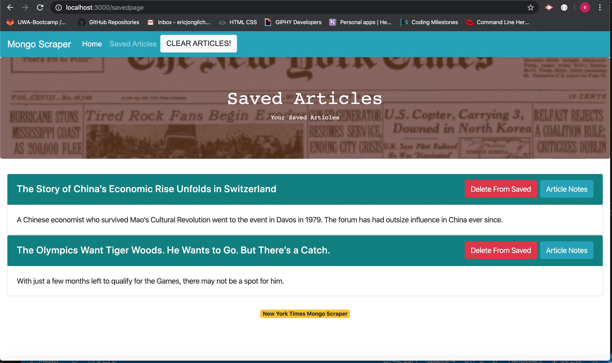
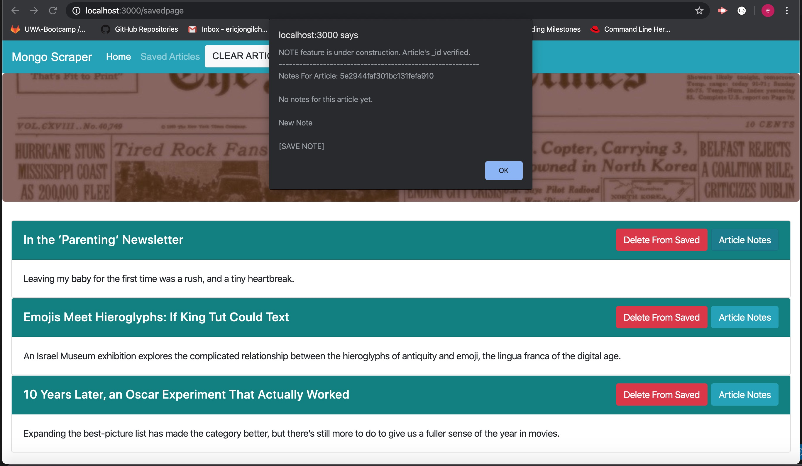

# Mongo Scraper New York Times edition

### `Mongo_Scraper` is an app that a user can scrape the current New York Times articles and make notes on the saved articles. 

### App running screenshots

Figure 1. Initial loading of homepage

Figure 2. Initial loading of saved page

Figure 3. `Scrape New Article!` button clicked and scraped articles rendered on homepage.

Figure 4. `Save Article` button clicked on homepage and the saved srticles rendered on saved page.

Figure 5. `Article Notes` button clicked on saved page alerts with article's _id. Modal pop-up function is under construction.

Current Development
- GitHub Repo created
- File directories structure
- Basic front end design with Bootstrap
- Scraping nytimes.com articles manually using `localhost:3000/scrape` and store `id`, `headline`, `url` and `summary` data into `mongoHeadlines` database in MongoDB
- Scrape new article button click handling and displaying scraped article on main page
- Clear articles button click handling and delete all articles in the database
- Save article button click handling and saved article rendering
- Delete article from saved page button click handling and removal from database
- `Article Notes` button click event identifies the article's _id

Under Construction: 
- More Notes features - modal pop-up, save new note, delete note, rendering all existing notes
- Heroku deployment link will be posted upon deployment

Programming tool used
- HTML, CSS, Bootstrap, express-handlebars, Javascript, jQuary, Axios, npm packages, NodeJs, Mongoose and MongoDB